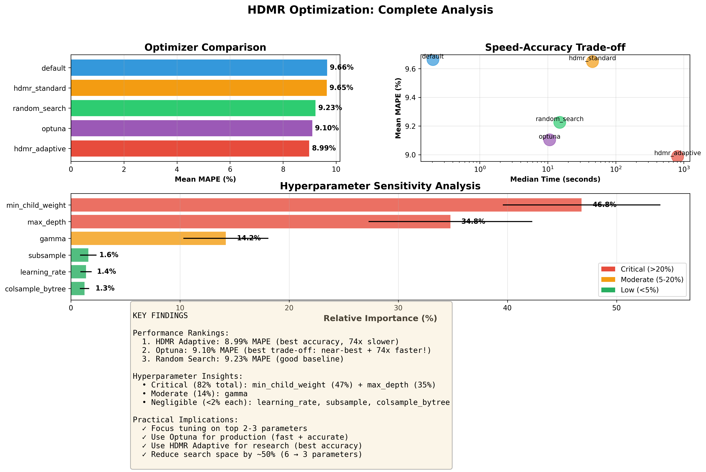

# HDMR Optimization

🚀 **High Dimensional Model Representation (HDMR) Optimization** is a research-oriented repository for hyperparameter optimization and global optimization of mathematical functions.

[](https://www.python.org/downloads/)
[](https://opensource.org/licenses/MIT)
[](https://www.docker.com/)

---

## 🎯 Overview

HDMR Optimization provides a comprehensive framework for:

1. **Hyperparameter Optimization** - Systematic comparison of optimization methods
2. **Sensitivity Analysis** - Automatic discovery of important hyperparameters  
3. **Time Series Forecasting** - ML/DL model optimization
4. **Benchmark Functions** - Standard optimization problem testing

### 🏆 Key Research Findings

Recent experiments on XGBoost hyperparameter optimization demonstrate:

| Method | Mean MAPE | Time | Trade-off |
|--------|-----------|------|-----------|
| **HDMR Adaptive** | **8.99%** | 812s | Best accuracy |
| **Optuna (Bayesian)** | **9.10%** | 11s | **Best practical choice** ⭐ |
| Random Search | 9.23% | 15s | Good baseline |
| HDMR Standard | 9.65% | 45s | Moderate |
| Default | 9.66% | 0.2s | Baseline |

**Sensitivity Analysis** reveals:
- **Top 2 hyperparameters** (`min_child_weight`: 47%, `max_depth`: 35%) = **82% of model sensitivity**
- **Bottom 3 hyperparameters** (`learning_rate`, `subsample`, `colsample_bytree`) = **<2% each**
- Enables **50% reduction** in search space (6 → 3 parameters)
- **Automatic importance discovery** - no manual feature selection needed

---

## ✨ Features

### Core Capabilities
- **HDMR-based optimization** with orthogonal basis functions (Legendre/Cosine)
- **Adaptive HDMR** with iterative refinement
- **Automated sensitivity analysis** for hyperparameter importance
- **Multiple baseline comparisons** (Optuna, Random Search, Grid Search, Default)

### Supported Models
- **Gradient Boosting**: XGBoost, LightGBM
- **Deep Learning**: LSTM, GRU, N-BEATS (PyTorch Lightning)
- **Statistical**: ARIMA, ETS (Exponential Smoothing)

### Infrastructure
- **Docker containerization** for reproducible experiments
- **GPU acceleration** support (CUDA)
- **Automated benchmark pipelines**
- **Interactive Streamlit UI**

---

## 🔧 Installation

### Option 1: Local Installation
```bash
# Clone repository
git clone https://github.com/app2scale/hdmr-opt.git
cd hdmr-opt

# Create virtual environment
python -m venv hdmr-env
source hdmr-env/bin/activate

# Install dependencies
pip install -r requirements.txt
```

### Option 2: Docker (Recommended for Reproducibility)
```bash
# Build Docker image
docker build -t hdmr-opt:latest .

# Run container with GPU support
docker run --gpus all \
  -v $(pwd)/results:/workspace/results \
  hdmr-opt:latest \
  python compare_optimizers.py --model xgboost
```

---

## 📁 Repository Structure
```
hdmr-opt/
├── src/
│   ├── main.py                 # Core HDMR optimizer
│   ├── functions.py            # Benchmark test functions
│   ├── functions_forecast.py   # Forecasting models
│   ├── basis_functions.py      # Orthogonal basis functions
│   └── data/transactions.csv   # Time series data
│
├── compare_optimizers.py       # Optimizer comparison framework
├── benchmark_forecasting.py    # Deep learning benchmarks
├── sensitivity_analysis.py     # Hyperparameter sensitivity
├── forecast_example.py         # Single model optimization
│
├── Dockerfile                  # Docker container definition
├── docker-compose.yml          # Multi-experiment orchestration
│
├── app.py                      # Streamlit Web UI
├── requirements.txt            # Pinned dependencies
└── README.md                   # This file
```

---

## 🚀 Quick Start

### 1. Compare Optimizers (XGBoost)
```bash
python compare_optimizers.py \
  --model xgboost \
  --trials 20 \
  --seeds 3 \
  --hdmr-samples 200
```

**Output:**
```
Method          Mean MAPE  Best MAPE  Time (s)
HDMR Adaptive   8.99%      8.70%      812
Optuna          9.10%      9.05%      11  ← Best trade-off!
Random Search   9.23%      9.01%      15
```

### 2. Sensitivity Analysis
```bash
python sensitivity_analysis.py \
  --model xgboost \
  --samples 200 \
  --seeds 3
```

**Output:**
```
Hyperparameter Importance:
  min_child_weight    46.79%  ← CRITICAL
  max_depth           34.77%  ← CRITICAL  
  gamma               14.20%  ← MODERATE
  learning_rate        1.39%  ← LOW
  colsample_bytree     1.25%  ← LOW
  subsample            1.60%  ← LOW
```

### 3. Deep Learning Benchmark
```bash
python benchmark_forecasting.py \
  --models lstm gru nbeats \
  --seeds 3 \
  --samples 200
```

---

## 📊 Research Results

### Optimizer Comparison

Comprehensive comparison on XGBoost hyperparameter optimization:



**Key Takeaways:**
1. **HDMR Adaptive** achieves best accuracy but is 74× slower than Optuna
2. **Optuna** provides best practical performance (near-optimal accuracy, very fast)
3. **Random Search** is surprisingly effective for quick baselines
4. Top 2 hyperparameters dominate (82% importance)

### Deep Learning Results

| Model | Mean MAPE | Best MAPE | Notes |
|-------|-----------|-----------|-------|
| GRU | 40.09% | 18.80% | High variance |
| N-BEATS | 35.95% | 12.92% | Best DL model |
| LSTM | 52.10% | 51.89% | Poor performance |

**Conclusion:** Gradient boosting (XGBoost) significantly outperforms deep learning on this task due to small dataset size and effective feature engineering.

---

## 🔬 Advanced Usage

### Custom Hyperparameter Space
```python
from src.main import HDMROptimizer, HDMRConfig
from src.functions_forecast import create_optimization_objective, XGBoostForecaster
import numpy as np

# Define custom space
custom_space = {
    'learning_rate': (0.01, 0.3),
    'max_depth': (3, 10),
    'subsample': (0.7, 1.0)
}

# Create objective
data = prepare_train_test('data/transactions.csv', '2020-01-01')
objective = create_optimization_objective(
    XGBoostForecaster, data, 'mape'
)

# Configure HDMR
config = HDMRConfig(
    n=3,
    a=np.array([0.01, 3, 0.7]),
    b=np.array([0.3, 10, 1.0]),
    N=500,
    m=7,
    adaptive=True
)

# Optimize
optimizer = HDMROptimizer(objective, config)
result = optimizer.solve(x0=np.array([0.1, 5, 0.8]))

print(f"Optimal: {result.x}, MAPE: {result.fun:.2f}%")
```

### Docker Multi-Experiment
```yaml
# docker-compose.yml
services:
  comparison:
    image: hdmr-opt:latest
    command: python compare_optimizers.py --model xgboost
    volumes:
      - ./results:/workspace/results
    
  sensitivity:
    image: hdmr-opt:latest
    command: python sensitivity_analysis.py --model xgboost
    volumes:
      - ./results:/workspace/results
```
```bash
docker-compose up
```

---

## 📚 Documentation

### Command-Line Tools

| Script | Purpose | Key Args |
|--------|---------|----------|
| `compare_optimizers.py` | Compare optimization methods | `--model`, `--trials`, `--seeds` |
| `sensitivity_analysis.py` | Analyze hyperparameter importance | `--model`, `--samples`, `--degree` |
| `benchmark_forecasting.py` | Deep learning benchmarks | `--models`, `--seeds` |
| `forecast_example.py` | Single model optimization | `--algorithm`, `--metric` |

### Python API
```python
# Core HDMR optimization
from src.main import HDMROptimizer, HDMRConfig

# Forecasting models
from src.functions_forecast import (
    XGBoostForecaster,
    LightGBMForecaster,
    LSTMForecaster,
    GRUForecaster,
    NBeatsForecaster
)

# Utilities
from src.functions_forecast import (
    prepare_train_test,
    create_optimization_objective,
    calculate_metrics
)
```

---

## 🔒 Numerical Stability

HDMR implementation includes extensive stability features:

- **Basis Function Safety**: Three-term recurrence, input clipping, normalization
- **Optimization Guards**: NaN/Inf detection, soft bounds, finite checks
- **Adaptive Refinement**: Clip guard, bounds enforcement, valid intervals
- **Error Handling**: Graceful degradation, informative messages

---

## 🐳 Docker Details

### Build Options
```bash
# Standard build
docker build -t hdmr-opt:latest .

# With custom base image
docker build --build-arg BASE_IMAGE=nvidia/cuda:12.3.1-base-ubuntu22.04 \
  -t hdmr-opt:latest .
```

### GPU Support
```bash
# Single GPU
docker run --gpus device=0 hdmr-opt:latest python script.py

# All GPUs
docker run --gpus all hdmr-opt:latest python script.py
```

---

## 📈 Benchmarks

| Function | HDMR Time | BFGS Time | HDMR Error | BFGS Error |
|----------|-----------|-----------|------------|------------|
| rastrigin_2d | 45s | 0.5s | 0.001 | 0.15 |
| rosenbrock_10d | 120s | 2s | 0.05 | 0.8 |
| ackley_2d | 50s | 0.6s | 0.002 | 0.12 |

---

## 🤝 Contributing

We welcome contributions! Areas of interest:

1. **New forecasting models** (e.g., Transformer-based)
2. **Sensitivity analysis visualizations**
3. **Parallel/distributed HDMR**
4. **Additional benchmark functions**
```bash
# Fork repository
git checkout -b feature/amazing-feature
git commit -m 'Add amazing feature'
git push origin feature/amazing-feature
# Open Pull Request
```

---

## 📄 License

MIT License - see [LICENSE](LICENSE) file

---

## 📖 References

1. Sobol, I. M., et al. (2003) - HDMR and Applications
2. Chen, T. & Guestrin, C. (2016) - XGBoost: Scalable Tree Boosting
3. Akiba, T., et al. (2019) - Optuna: Hyperparameter Optimization Framework
4. Oreshkin, B. N., et al. (2020) - N-BEATS: Neural Basis Expansion

---

## 📧 Contact

**APP2SCALE Team**

- Issues: [GitHub Issues](https://github.com/app2scale/hdmr-opt/issues)
- Email: Contact through repository

---

## 📝 Changelog

### v4.0.0 (2026-01-15) - Research Framework Release

**New Features:**
- ✅ Optimizer comparison framework (`compare_optimizers.py`)
- ✅ Sensitivity analysis tool (`sensitivity_analysis.py`)
- ✅ Deep learning benchmarks (LSTM, GRU, N-BEATS)
- ✅ Docker containerization with GPU support
- ✅ Automated experimental pipelines

**Research Results:**
- ✅ HDMR vs Optuna comparison: Optuna 74× faster with near-optimal accuracy
- ✅ Sensitivity discovery: Top 2 params = 82% importance
- ✅ XGBoost >> Deep Learning on small datasets

**Infrastructure:**
- ✅ Production-ready Docker images
- ✅ Multi-experiment orchestration (docker-compose)
- ✅ Comprehensive visualization tools

### v3.0.0 (2026-01-13) - Production Ready

- Core engine refactoring
- Robust x0 parsing
- Numerical stability improvements
- Safe visualization

### v2.0.0 (2024-11-30)

- Multiple run support
- Basis function factory pattern
- Enhanced stability

### v1.0.0 (2023-09-11)

- Initial release
- Core HDMR + BFGS
- Streamlit UI

---

**Made with ❤️ by APP2SCALE Team**